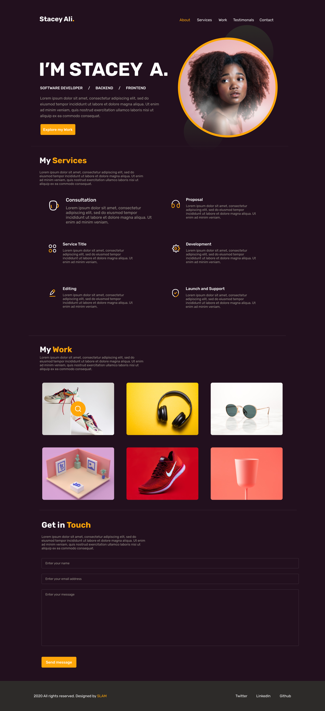

# My Portfolio

This is my software development portfolio. 

**Link to project:** https://staceyali.netlify.app

## How It's Made:

**Tech used:** HTML, CSS, JavaScript, and delpoyed this on netlify

I built this portfolio as an avenue to showcase what I have been working on. It is front-end website that is well linked to some clients who have graciously allowed me to share and a few personal projects,

## Optimizations
If i were to build this portfolio again I would probably use the react framework to build this. This is because I find that it is simple and it has excellent cross-platfrom support. 

## Lessons Learned:

I learned that inorder to build a successful site, I need to start with the end in mind. 
I also learned to always set deadlines for finishing projects.
